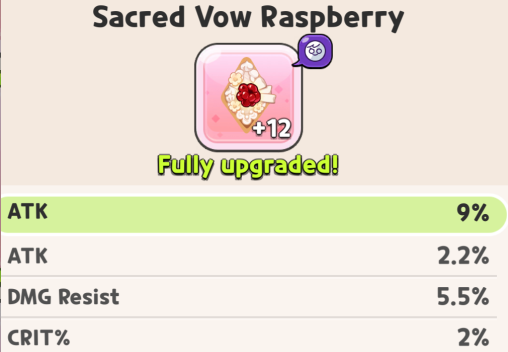
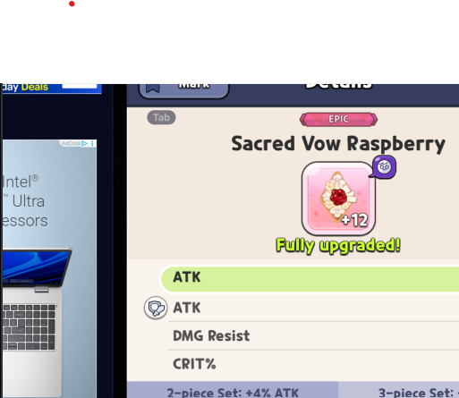

# Crk-Topping-Scanner

### _Link to the latest release can be found [here](https://github.com/duocaleb/Crk-Topping-Scanner/releases)_

## How to scan
1. Full screen the game. This scanner will not work otherwise.
2. Open any cookie and click on their toppings.
3. Select any topping and click screenshot. See below for an example of good and bad screenshots.
4. Press Read once the screenshot is taken.
4. Comfirm that the scanned resonant type, topping type and substats are correct. This may take a second to load.
5. Click on Add Topping to add it to the list.
6. Once you're finished scanning, click on Export to export the list. The exported JSON can be found in Crk-Exports

# Below is an example of a good screenshot

# Below are examples of a bad screenshot

